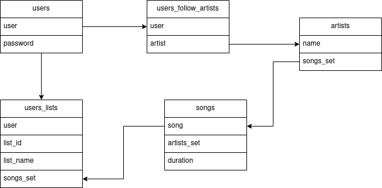

# wyg-music

Music Wherever You Go is a self-hosted music service. I pretend to do the server with flask and then with ruby on rails.

# Project time-line

<dl>

<dt> <b>20 / 11 / 2022</b> </dt>

<dd> Create app
<dd> Design structure of folders and files
<dd> Create home and user page (just files, not design)

<dt> <b>22 / 11 / 2022</b> </dt>

<dd> Added music bar
<dd> Music bar still sound while changing between home and user page

<dt> <b>23 / 11 / 2022</b> </dt>

<dd> Divide app file in different files for modularity
<dd> Created search bar (just html, not working)
<dd> Redis database diagram (probably not final)

</dl>

# Redis database diagram

